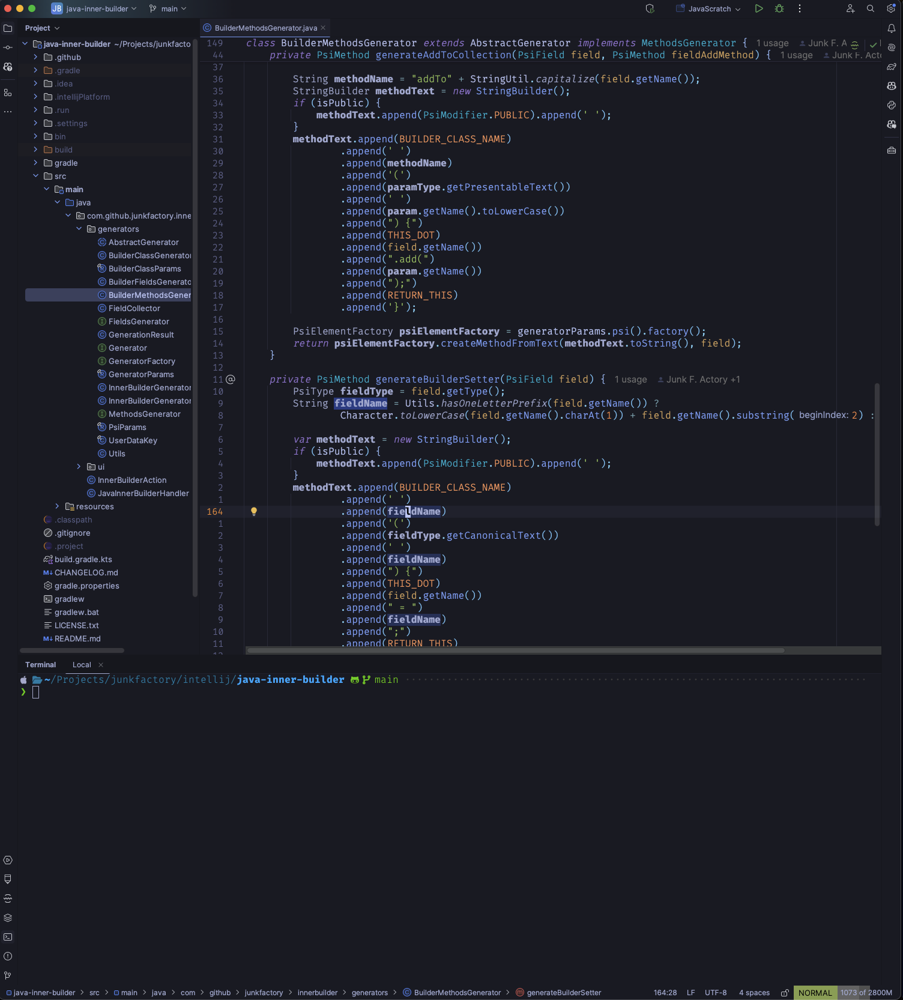
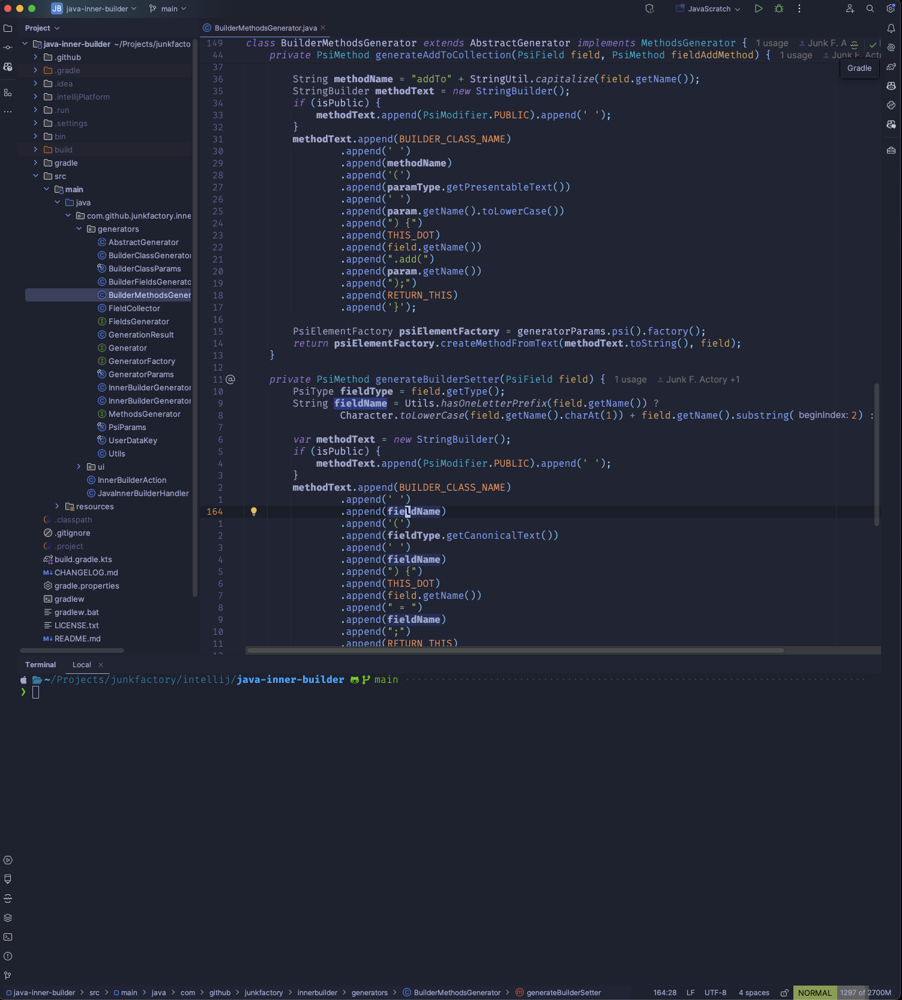
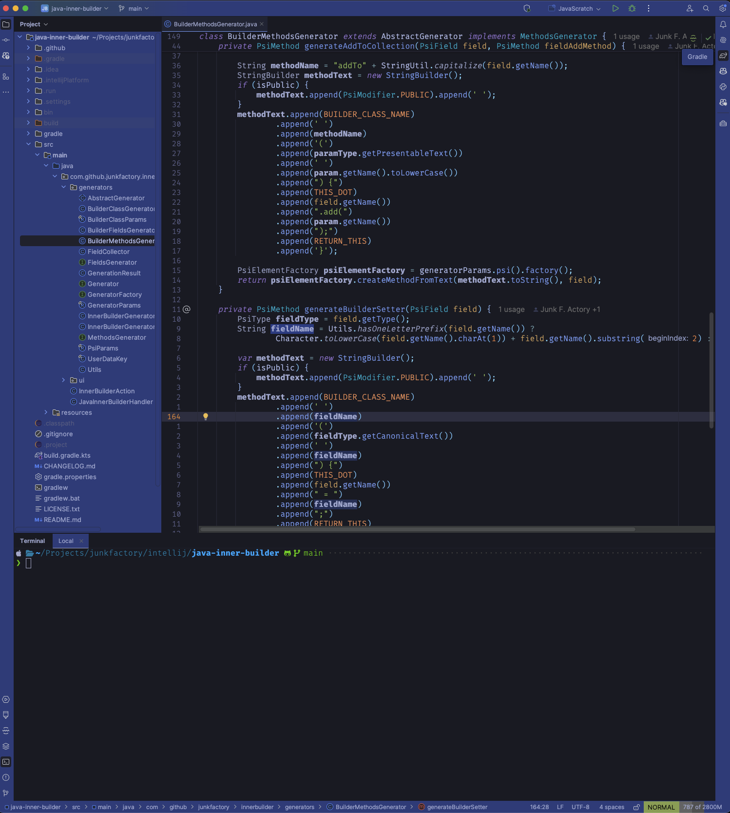

# 🏙 Tokyo Dark

<!-- Plugin description -->

A dark Jetbrains theme ported from the Visual Studio Code
[TokyoNight](https://github.com/enkia/tokyo-night-vscode-theme) theme.

Originally a fork from [alexdhy/tokyonight-jetbrains](https://github.com/alexadhy/tokyonight-jetbrains)
only supporting the dark and storm variants. If you need other variants then look there.

Moved from [junkfactory/tokyonight-jetbrains](https://github.com/junkfactory/tokyonight-jetbrains), 
repo name must be unique so the new one is `tokyodark-jetbrains`.

<!-- Plugin description end -->

## Available Themes

Tokyo Night Dark

Tokyo Night Storm

Tokyo Dark Contrast

## Differences between this one and the theme by Grafikart

- Main difference is just this theme includes the UI theme too,
  without relying on the user to install Material UI theme.
- Tokyo night dark variants support only, no day support.
- Otherwise everything is (about) the same.
- Go checkout his theme as well if you think that this one doesn't fit you: [Grafikart/tokyo-night-jetbrains-theme](https://github.com/Grafikart/tokyo-night-jetbrains-theme)

## Installation

_On Your Jetbrains IDE_:

- Open Settings/Preferences
- Plugins
- Marketplace
- Search for "Tokyo Night Dark Theme"
- Install Plugin

Copyright &copy; 2025-present [Junk F. Actory](https://github.com/junkfactory/tokyodark-jetbrains)
