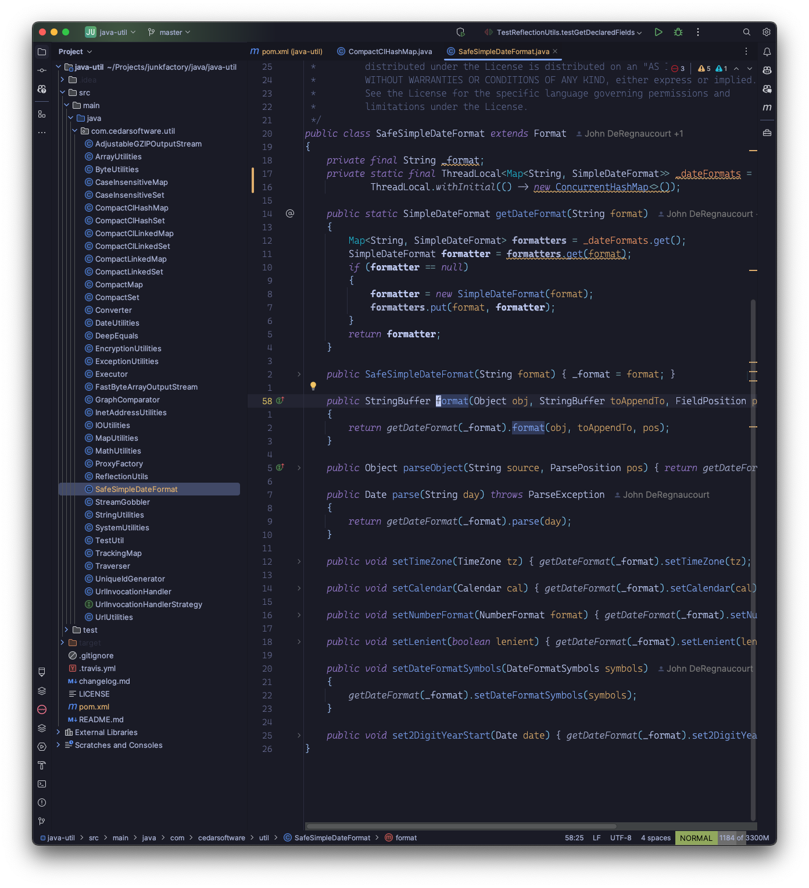

# 🏙 Tokyo Dark

A dark Jetbrains theme ported from the Visual Studio Code [TokyoNight](https://github.com/enkia/tokyo-night-vscode-theme) theme.

A fork from [alexdhy/tokyonight-jetbrains](https://github.com/alexadhy/tokyonight-jetbrains) only supporting
the dark variant. If you need other variants then look there.

- TokyoDark

## Differences between this one and the theme by Grafikart

- Main difference is just this theme includes the UI theme too, without relying on the user to install Material UI theme.
- Tokyo-Night Dark support, planned support for Tokyo Night Day
- Otherwise everything is (about) the same.
- Go checkout his theme as well if you think that this one doesn't fit you: [https://github.com/Grafikart/tokyo-night-jetbrains-theme](https://github.com/Grafikart/tokyo-night-jetbrains-theme)

## Installation

_On Your Jetbrains IDE_:

- Open Settings/Preferences
- Plugins
- Marketplace
- Search for "Tokyo Night Dark Theme"
- Install Plugin

Copyright &copy; 2024-present [Junk F. Actory](https://github.com/junkfactory/tokyonight-jetbrains)
